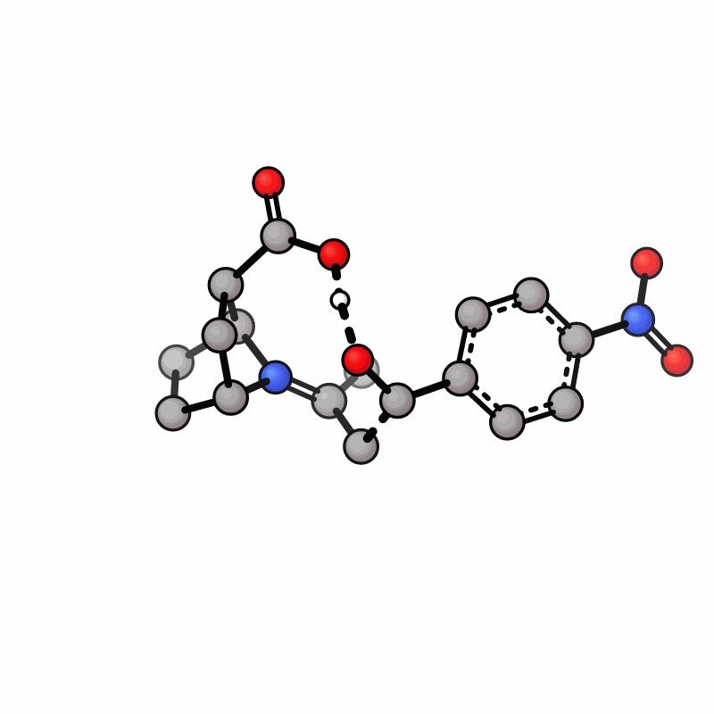
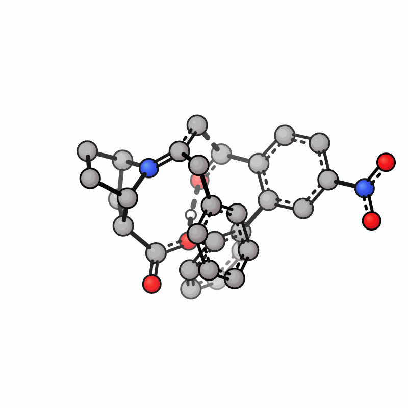
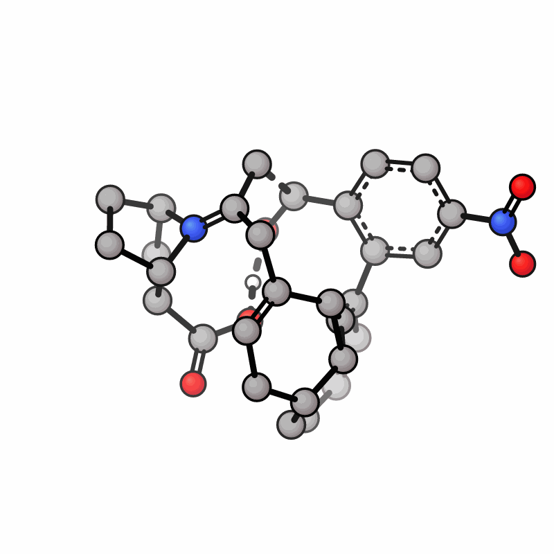
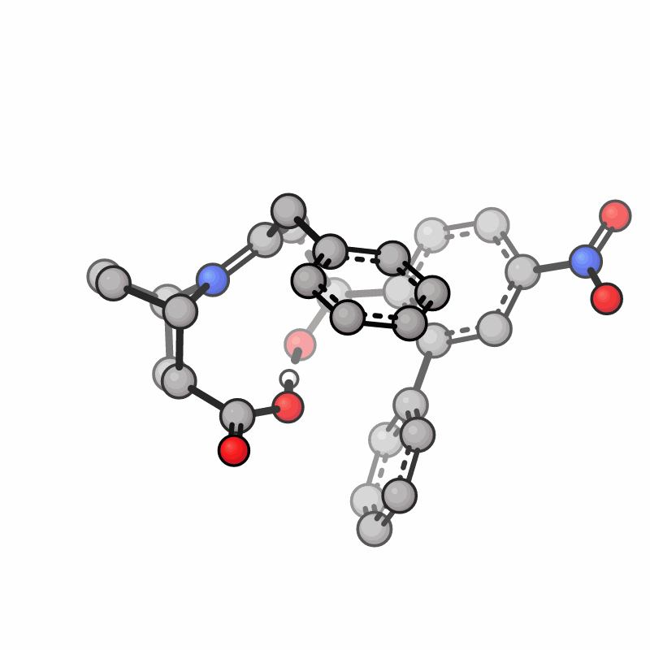

# beautize

**用 GaussView 已有的键连约束 GFN-FF，在不破坏参考核心的前提下清理建模后的原子碰撞。**

做过渡态复现、同系物建模或取代基扫描时，通常来说，起始点是从文献/先前计算拿到的一个已经有意义的参考结构。我们通常希望保留反应核心，只替换外围基团；但在 GaussView 等建模工具里完成取代基替换后，新基团上的原子很容易直接撞进原结构，甚至出现大面积堆叠。

这些碰撞必须在 DFT 优化之前处理掉。问题在于，这一步需要的并不是把整个分子优化到一个力场极小值，而是**只把建模产生的坏接触整理开，同时保住参考结构中真正有价值的几何信息。**

GaussView 的 Clean（扫把工具）适合快速整理普通结构，但参考过渡态建模通常不能接受整个模型自由弛豫。核心一旦被重排，参考建模本身的意义就被削弱了。

通用力场当然也可以做 constrained optimization，但这里往往同时要求：使用现有拓扑（gfnff out）、可以设置冻结（扫把out）、对各种体系参数都相对可靠（uff out）、操作简单（专业动力学软件out），想在一个软件凑齐这些属性还是有一些难度的，至少笔者目前没有看到顺手的。

xTB 在正常初始结构上很好用，但外围原子高度重叠 + 冻结是一个很不友好的初始条件。此时它并不会把 GaussView 里的 connectivity 当成固定拓扑；为了逃离极端排斥，几何可能发生远超预期的重排。在 `examples/` 的模型里，就可以看到冻结核心后得到明显不合理的稠环样、分解的结构。

`beautize` 就是做这件事的。它是 DFT 之前的一步 constrained cleanup。`beautize`读取 Gaussian/GaussView GJF 中保存的 Cartesian 坐标、connectivity 和键级，把现有键连直接交给内置的 GFN-FF 力场，再在冻结原子或 B/A/D 内坐标约束下做优化，把明显不合理的堆叠清掉，然后把坐标写回 GJF。

## 示例

`examples/crash.gjf` 是一个替换取代基后发生严重碰撞的模型。我们用同一组冻结原子比较原始结构、xTB 处理结果和 beautize 结果。

| 文献中的TS | 替换取代基后 | GFN2-xTB直接优化 | beautize消除碰撞 |
| --- | --- | --- | --- |
|  |  |  |  |

xTB和beautize优化时都冻结了19,20,25,28,29原子。可以看到xTB优化出了一个奇异稠环，使得整个体系都失去了参考意义，而beautize仍然很好地保留了核心区，同时将外部不合理接触优化掉了，可以直接用于后续DFT计算。

## 核心设计

### 1. GJF connectivity 是权威拓扑

beautize 读取 GJF 的显式连接表和键级，并把 bond-order matrix 直接传给 GFN-FF。GFN-FF 初始化完成后，程序还会检查实际邻接表是否与输入图一致；如果不一致就报错，不会静默换成猜测拓扑。

这正是它适合处理 crash geometry 的原因：坐标可以很难看，但只要你画的键连是对的，拓扑就不会因为原子暂时挤在一起而被重新解释。

### 2. 核心可以真正锁住

支持直接读取 GJF 中已有的：

* Cartesian 行里的 `-1` freeze flag；
* `Opt=ModRedundant` / `Opt=ModR` 中的 `F` 记录。

也可以从命令行添加冻结原子、mobile region，以及 bond / angle / dihedral 约束。

Cartesian freeze 直接移除对应自由度；B/A/D 约束通过约束恢复和梯度投影保持，不使用大弹簧罚函数。

### 3. GFN-FF 只负责把坏接触整理开

能量和梯度来自 GFN-FF library，几何优化使用 constrained projected L-BFGS。beautize 的目的不是让力场重新定义你的模型，而是在你指定的拓扑和约束范围内，把初始结构整理到能继续做量化计算的程度。

## 快速使用

输入需要是**带显式 connectivity 的 Cartesian GJF**（gview保存可以直接写入connectivity）。

如果 GJF 里已经写好了 freeze / ModRedundant：

```sh
beautize model.gjf -o model.clean.gjf
```

不指定 `-o` 时，默认生成：

```text
model.beautized.gjf
```

同时会生成同名 JSON 报告。

### 冻结参考核心

```sh
beautize model.gjf \
  --freeze 1-38,45,48-50 \
  -o model.clean.gjf
```

或者只允许某一段原子移动：

```sh
beautize model.gjf \
  --mobile 39-57 \
  -o model.clean.gjf
```

原子编号从 **1** 开始。`--mobile` 不会解除 GJF 中已经存在的冻结。

### 保留关键内坐标

不写目标值时，使用原始输入结构中的值：

```sh
beautize model.gjf \
  --bond 12,39 \
  --angle 8,12,39 \
  --dihedral 7,8,12,39 \
  -o model.clean.gjf
```

也可以显式给目标：

```sh
beautize model.gjf \
  --bond 12,39=1.50 \
  --angle 8,12,39=120 \
  --dihedral 7,8,12,39=180 \
  -o model.clean.gjf
```

长度单位为 Å，角度单位为 degree。

### 外部约束文件

```text
X 1 F
B 12 39 F
A 8 12 39 F
D 7 8 12 39 180 F
```

```sh
beautize model.gjf \
  --constraints core.constraints \
  -o model.clean.gjf
```

支持 `X/B/A/D ... F`，也支持沿显式连接图展开的通配符，例如 `B * * F`、`A * 2 * F`、`D * 2 3 * F`。除 `F` 之外的 ModRedundant 操作会直接报错，不会被静默忽略。

### 先检查约束

```sh
beautize model.gjf --freeze 1-38 --dry-run
```

`--dry-run` 只解析、展开并检查约束，不初始化 GFN-FF，也不生成优化结果。

## 推荐流程

1. 在 GaussView 中基于参考结构替换取代基，并保存带 connectivity 的 GJF。
2. 用 GJF freeze / ModRedundant，或 `--freeze`、`--mobile`、B/A/D，把不希望在预处理阶段改变的核心锁住。
3. 运行 beautize，检查输出结构和 JSON 报告。
4. 把清理后的结构交给真正的 DFT optimization / TS optimization / frequency calculation。

beautize 默认**拒绝无约束优化**。如果约束因为输入错误没有被读到，它不应该顺手把整套参考结构优化掉。确实需要无约束运行时，显式使用：

```sh
--allow-unconstrained
```

## 输出

正常收敛后，beautize 写出新的 GJF，并尽量保留原始文件的 route、标题、元素标签、freeze column、connectivity、ModRedundant 和尾部内容，只更新坐标。

JSON 报告记录：

* 输入键级和 GFN-FF 实际邻接图检查；
* 有效冻结原子和内部坐标约束；
* 约束目标、最终值和误差；
* 投影后的 `fmax`、能量和接受步历史；
* 初始约束恢复位移与冻结漂移；
* 最终收敛状态。

命令行或外部文件添加的约束只对**本次 beautize** 生效，会进入 JSON，但不会自动写回 Gaussian 的 ModRedundant block。后续 Gaussian 计算如果仍需要这些约束，需要在 Gaussian 输入里另外保留。

未收敛时返回 exit code `2`，默认不发布正常命名的最终 GJF；需要保留当前结构时可加 `--keep-partial`。

更多优化参数见：

```sh
beautize --help
```

## 构建

需要 CMake >= 3.21、C/C++17/Fortran 编译器、BLAS 和 LAPACK；OpenMP 可选。

```sh
cmake -S . -B build -DCMAKE_BUILD_TYPE=Release
cmake --build build --parallel 4
ctest --test-dir build --output-on-failure
./build/beautize --version
```

没有 OpenMP 时：

```sh
cmake -S . -B build-serial -DCMAKE_BUILD_TYPE=Release \
  -DBEAUTIZE_OPENMP=OFF
cmake --build build-serial --parallel 4
```

不构建测试：

```sh
cmake -S . -B build -DBEAUTIZE_BUILD_TESTS=OFF
```

安装到自选前缀：

```sh
cmake --install build --prefix "$HOME/.local"
```

## 输入范围

目前支持单结构 Cartesian Gaussian input：一个 charge/multiplicity，元素符号或原子序数，可选 `0/-1` freeze column，Å 单位坐标，以及完整的 connectivity block。

连接表需要覆盖每个原子，包括没有后续连接的裸编号行。支持多行 route、`D` 指数、CRLF，以及 `O(Fragment=1)` 一类元素标签。Fragment 标签会原样保留，但不会自动转换成独立片段电荷约束。

## License

beautize 的独立代码使用 MIT license。GFN-FF 及其修改保留 LGPL-3.0-or-later。详见 `LICENSE`、`THIRD_PARTY.md`、`third_party/gfnff/LICENSE` 和 `licenses/GPL-3.0.txt`。
